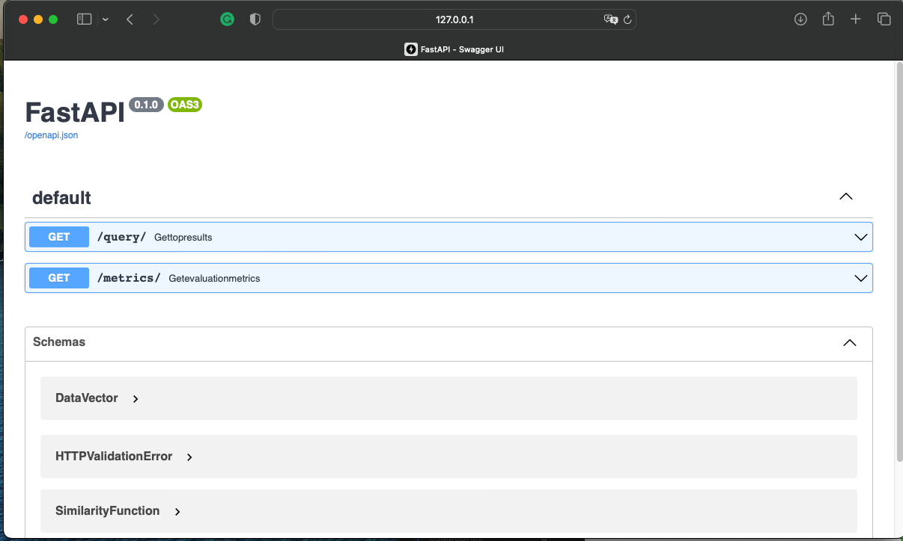
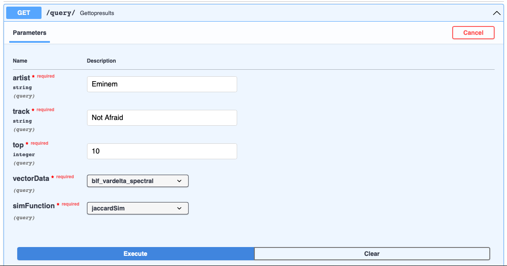
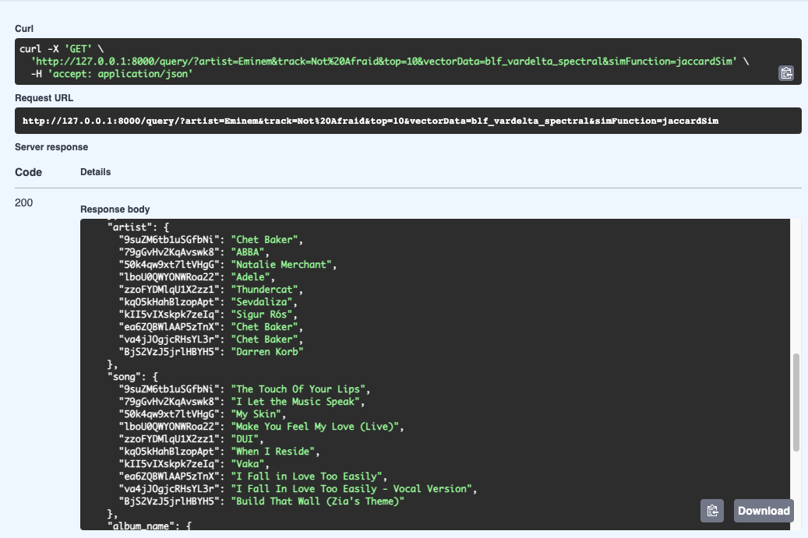

# MMSR

## Report
Link to report: https://www.overleaf.com/read/hjvjcvffndyf

## Files included
| File | Description |
|--- | --- |
| `./project/main.py` | API developed for the implementation of the project|
| `./project/files.py`| Contains the variables that have the reference to the datasets files. Also If you want to run the project from zero, to generate the top ids while doing queries on the API change the first variable to `USE_COMPLETE_DATASETS = False` |
| `./project/functions.py`| Contains the developed functions to solve the task |
| `./project/ImplementationTask2.ipynb` | **Contains the similarity functions used**, and the implementation of the computation of the top 100 ids for each of the features.|
| `./project/EvaluationMetrics-.ipynb` | Contains the implementation of the functions to calculate the **MAP, MRR, NDCG and Kendall Tau correlation**. And the generation of the **Precision/Recall plots.** |
| `./project/StatisticalDataAnalysis.ipynb` | Contains the **statistical data analysis** |


## Todo

1. Download the datasets if you don't want to run all the simulation from 0. Follow the instructions in the section *"Data generated from the tasks"*.

2. Include the datasets provided for the task.

    For the task 1 in `./MMSR_WT22_Task1_Data/`.

    For the task 2 in `./task2/`

## Run the API

### FastAPI Introduction
Install FastAPI on conda environment:
```conda install -c conda-forge fastapi```

Start the Webserver:
```uvicorn main:app --reload```

On standard settings the Webserver can be reached on:
```http://127.0.0.1:8000/docs```

### Possible Requests 
```/query/?artist=ARTIST&track=TRACK&top=NVALUE&vectorData=VECTOR&simFunction=SIMFUNC```

The query parameters values should be specified as **ARTIST** the name of the artist,  **TRACK** the song of the artist, **NVALUE** the number of songs to return as similar.

**VECTOR** could be 15 values *tfidf*, *word2vec*, *bert*, *mfcc_bow*, *mfcc_stats*, *essentia*, *incp*, *resnet*, *vgg19*, *blf_delta_spectral*, *blf_correlation*, *blf_logfluc*, *blf_spectral*, *blf_spectral_contrast*, *blf_vardelta_spectral*.

**SIMFUNC** could be *cosineSim*, *jaccardSim*


```/metrics/?k=KVALUE&vectorData=VECTORDATA&simFunction=SIMFUNCTION```

The query parameters values shoud be specified as **KVALUE** to get the @k metrics

**VECTORDATA** could be  15 values *tfidf*, *word2vec*, *bert*, *mfcc_bow*, *mfcc_stats*, *essentia*, *incp*, *resnet*, *vgg19*, *blf_delta_spectral*, *blf_correlation*, *blf_logfluc*, *blf_spectral*, *blf_spectral_contrast*, *blf_vardelta_spectral*.

**SIMFUNCTION** could be *cosineSim*, *jaccardSim*

### Example

In the next image you can see an enviroment to test the API and the availables queries. ```http://127.0.0.1:8000/docs```


An example of a query

The Results of the query


## Data generated from the tasks:

The data that was generated through the tasks is in the following links.

### Task 1
Top 100 Song id's : https://1drv.ms/u/s!AgdGFQd2-hyCiQPMTqJA4OvQ5glM?e=f8OV5W .

This data should be placed into `./project/topIds/`

The data contained in this folder is:

| File | Description | 
| --- | ----------- |
| top_ids_cosine_bert_complete.csv | Top 100 ids using **cosine similarity** with **bert** features |
| top_ids_cosine_tfidf_complete.csv | Top 100 ids using **cosine similarity** with **tfidf** features |
| top_ids_cosine_word2vec_complete.csv | Top 100 ids using **cosine similarity** with **word2vec** features |
| top_ids_innerProduct_bert_complete.csv | Top 100 ids using **innerProduct similarity** with **bert** features |
| top_ids_innerProduct_tfidf_complete.csv | Top 100 ids using **innerProduct similarity** with **tfidf** features |
| top_ids_innerProduct_word2vec_complete.csv | Top 100 ids using **innerProduct similarity** with **word2vec** features |
| top_ids_jaccard_bert_complete.csv | Top 100 ids using **jaccard similarity** with **bert** features |
| top_ids_jaccard_tfidf_complete.csv | Top 100 ids using **jaccard similarity** with **tfidf** features |
| top_ids_jaccard_word2vec_complete.csv | Top 100 ids using **jaccard similarity** with **word2vec** features |


### Task 2
Top 100 Song id's : https://1drv.ms/u/s!AgdGFQd2-hyCiQUSFLtDzvwGRVG-?e=aT7U68 .

This data should be placed into `./project/TopIdsTask2/`

The top 100 songs id files have the following structure. `top_ids_[similarity]_[feature]_complete.csv`

Where 
- similarity :
    - "jaccard"
    - "cosine"

- feature : 
    - "tfidf"
    - "word2vec"
    - "bert"
    - "mfcc_bow", 
    - "mfcc_stats"
    - "essentia"
    - "blf_correlation"
    - "blf_deltaspectral"
    - "blf_spectral"
    - "blf_spectralcontrast"
    - "blf_vardeltaspectral"
    - "blf_logfluc"
    - "incp"
    - "resnet"
    - "vgg19"

We also included some combinations of features. However, these combinations of features were not evaluated in this task

- feature : 
    - "tfidf_mfcc_bow_incp"
    - "bert_mfcc_bow_incp"
    - "tfidf_essentia_incp"
    - "bert_essentia_incp" 
    - "tfidf_blf_deltaspectral_incp"
    - "bert_blf_deltaspectral_incp"
    - "tfidf_mfcc_bow_vgg19"
    - "bert_mfcc_bow_vgg19"
    - "tfidf_essentia_vgg19"
    - "bert_essentia_vgg19"
    - "tfidf_blf_deltaspectral_vgg19"
    - "bert_blf_deltaspectral_vgg19"


| File | Size | Description | No Files |
| --- | ---| ----------- | --- |
| top_ids_**similarity**_**feature**_complete.csv | (68641,100) | For each of the files preiously mentioned we have a combination of feature and similarity, resulting in 27 x 2 = 54 datasets of the top 100 ids for each query.  | 54 |
| df_**similarity**_mean_precision_datasets_plot.csv | (15,100) | For each of the individual features we have the **mean of the precision** at K position, for K=1..100 for the 68,641 possible queries | 2 |
| df_**similarity**_mean_recall_datasets_plot.csv | (15,100) | For each of the individual features we have the **mean of the recall** at K position, for K=1..100 for the 68,641 possible queries | 2 |
| df_**similarity**_mean_maxprecision_datasets_plot.csv | (15,100) | For each of the individual features we have the **mean of the max precision to the right** at K position, for K=1..100 for the 68,641 possible queries | 2 |
| df_metrics_**similarity**.csv | (15,6) | For each of similarities and each of the individual features we computed the :MAP@10, MRR@10, NDCG@10, MAP@100, MRR@100, NDCG@100 | 2 |
| corr_all_values_tau_**similarity**.csv | (120,68641) | For each of combination of features without repetition, the correlation Kendall Tau value for each query in the two ranks  | 2 |
| correlations_**similarity**_tau.csv | (15,15) | For each of combination of features without repetition, the mean of correlation Kendall Tau value across all the queries | 2 |

